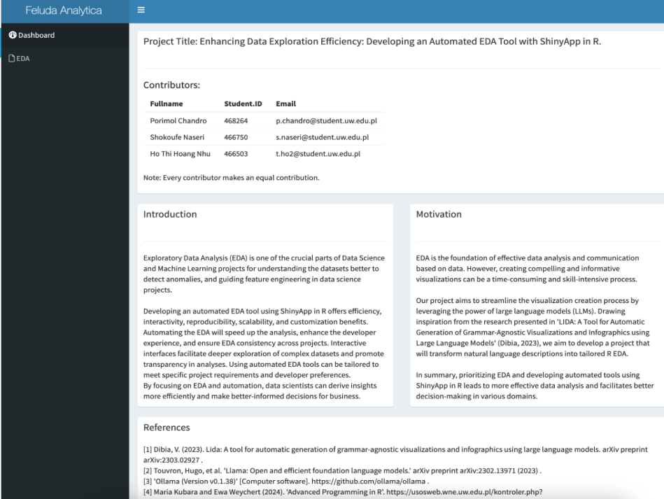
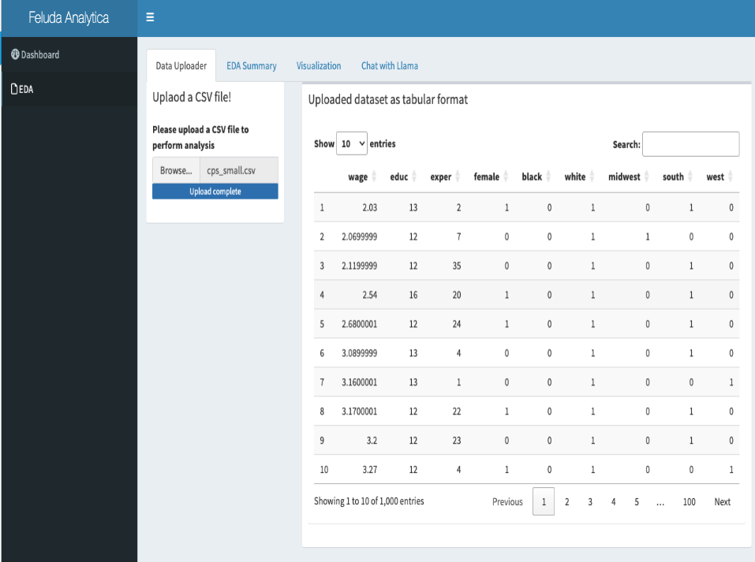
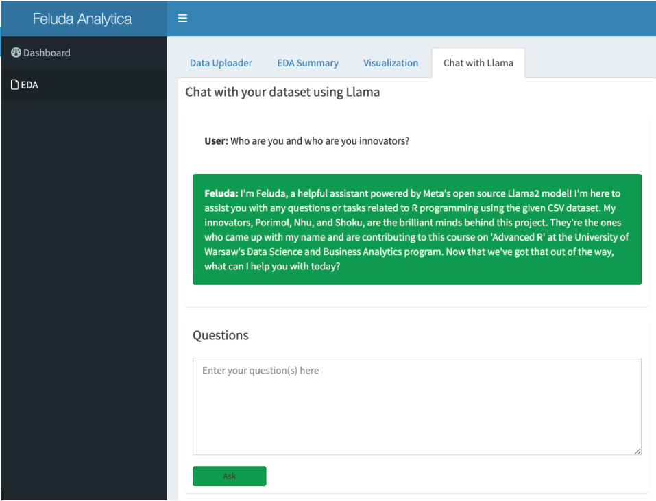
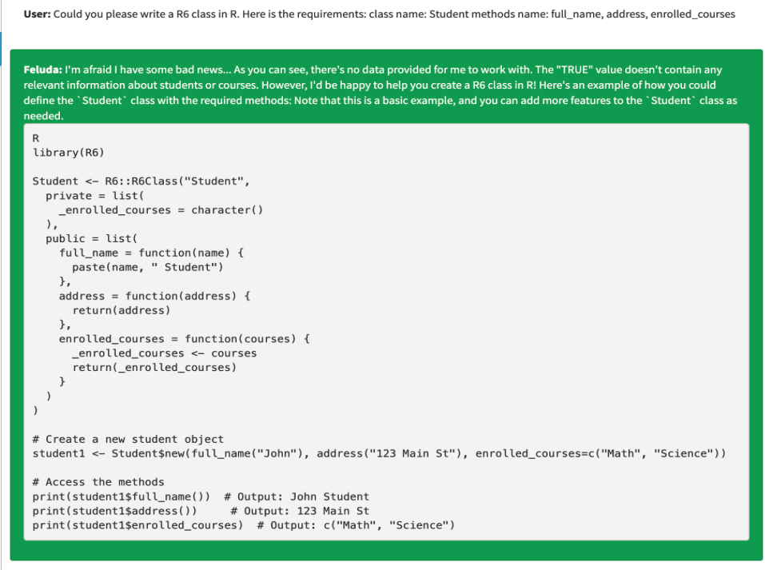

# Feluda Lidar
Enhancing Data Exploration Efficiency: Developing an Automated EDA Tool with ShinyApp in R


### Project structure:

```bash
.
├── README.md
├── app.R
├── chat.R
├── corrMatrix.cpp
├── eda.R
├── package_builder.R
├── project.Rproj
├── server.R
├── ui.R
├── LidaROllama
│   ├── README.md
│   ├── DESCRIPTION
│   ├── LICENSE
│   ├── LidaROllama.Rproj
│   ├── NAMESPACE
│   ├── R
│   │   └── LidaROllama.R
│   ├── man
│   │   └── LidaROllama.Rd
│   └── tests
│       └── testthat
│           └── test-ollama.R
└── LidaROllama_0.1.0.tar.gz
```

### Description of the project structure:
**Project Workflow:** The project is structured in a modular fashion, with each component performing a specific task. \
The main components include:

- **Initialization:** The project is set up in RStudio using project.Rproj for easy management.
- **UI Definition:** The ui.R script is used to design the interface of the web application.
- **Server Logic:** The server.R script implements the server-side functionality, responding to user inputs and updating the UI.
- **Combining UI and Server:** The app.R script integrates the UI and server components, initializing the Shiny application.
- **Additional Functionalists:**
  - chat.R handles chat-related features.
  - corrMatrix.cpp provides optimized C++ functions for correlation matrix computations.
  - eda.R performs exploratory data analysis on the data being used in the application.
- **Documentation:** README.md provides comprehensive documentation for users and developers, guiding them on how to set up and use the application.

**Package Development:** The `LidaROllama` package is developed to encapsulate the core functionality of the application, making it easier to maintain and distribute.

  - **README.md:** provides documentation for the package.
  - **DESCRIPTION:** contains metadata about the package.
  - **LICENSE:** specifies the licensing terms for the package.
  - **NAMESPACE:** defines the exported functions and dependencies.
  - **R:** contains the core R script for the package.
  - **man:** contains the documentation for the package.
  - **tests:** includes test scripts for the package.
  
**Package Distribution:** The `LidaROllama_0.1.0.tar.gz` file is the distributable package that can be installed in R.

### Pre-requisites:
1. Install [Ollama](https://ollama.com) and activate.
2. Run `ollama run llama3` to download Llama3.
2. R and RStudio installed on the system.
3. Required packages installed in R.
4. Basic understanding of R programming and Shiny applications.


### Instructions to run the project:
1. Open the `project.Rproj` file in RStudio.
2. Run the `app.R` script to launch the Shiny application.
3. Interact with the application to explore the data and generate insights.
4. Refer to the `README.md` for detailed instructions on using the application and the package.


### Screenshots:
#### Dashboard Page:

The project information is displayed on the dashboard page, providing an overview of the application's functionality and features.

#### Home Page:

The home page provides options to upload a dataset, view the correlation matrix, and access the chat interface.

#### Chat Interface:

The chat interface allows users to interact with the application using natural language queries.

##### Chat Interface with Response:

The chat interface provides responses to user queries, helping users navigate the application and generate insights.

### References:
1. [Shiny Documentation](https://shiny.rstudio.com/)
2. [R Documentation](https://www.rdocumentation.org/)
4. [C++ Documentation](https://en.cppreference.com/w/)
5. Dibia, V. (2023). Lida: A tool for automatic generation of grammar-agnostic visualizations and infographics using large language models. arXiv preprint arXiv:2303.02927 .
6. Touvron, Hugo, et al. 'Llama: Open and efficient foundation language models.' arXiv preprint arXiv:2302.13971 (2023) .
7. 'Ollama (Version v0.1.38)' [Computer software]. https://github.com/ollama/ollama .

### Disclaimer:
This project is for educational purposes only and is not intended for production use. The data used in the application is for demonstration purposes only and may not reflect real-world scenarios.

### License:
This project is licensed under the MIT License - see the LICENSE file for details.

